# Flight Booking application using nodejs and reactjs

## Description
This is a full-stack flight booking application built with Node.js and React.js. The application allows users to search, book, and manage flight reservations.

The application features a modern, user-friendly interface with robust functionality for both users and administrators. Users can easily search for flights using various filters, view flight details, and make bookings. Administrators have additional capabilities to manage flights, including adding, updating, and removing flight information.


Key Features:
- User authentication and authorization
- Flight search with filters (price range, airlines, available seats)
- Flight booking system
- Admin panel for managing flights
- Responsive design for all devices
- Real-time flight updates
- Secure payment processing

Tech Stack:
Frontend:
- React.js
- Tailwind CSS
- React Router
- React Context API
- React Toastify

Backend:
- Node.js
- Express.js
- MongoDB
- JWT Authentication
- Bcrypt for password hashing


## Installation
To run this application locally, follow these steps:

1. Clone the repository
```bash
git clone https://github.com/AbdurRaahimm/flight-booking.git
```
2. Go to Backend folder and run
```bash
cd Backend && npm start
```
3. to check backend url 
```bash
http://localhost:8080/
```
4. Go to frontend folder and run
```bash
cd frontend && npm run dev
```
5. to check frontend url 
```bash
http://localhost:5173/
```

## Live Link
https://flight-booking-sigma-six.vercel.app/

## Screenshits
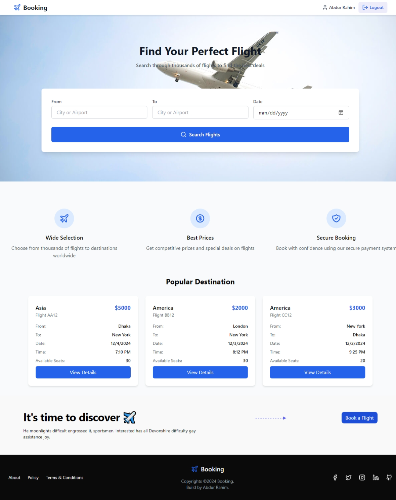
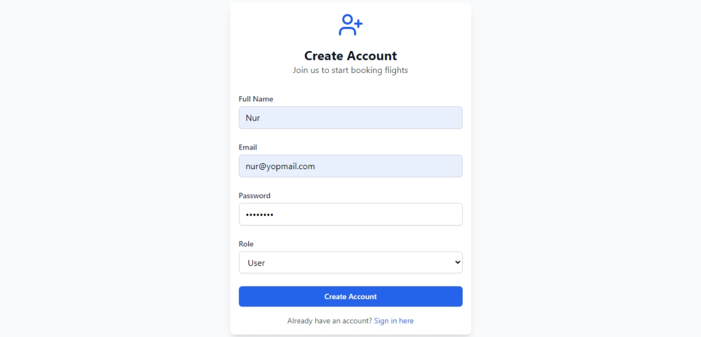
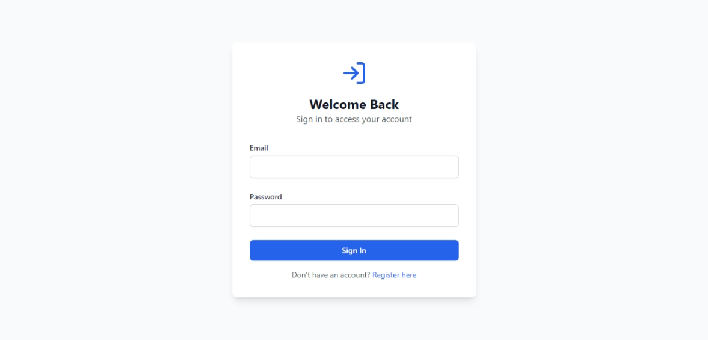
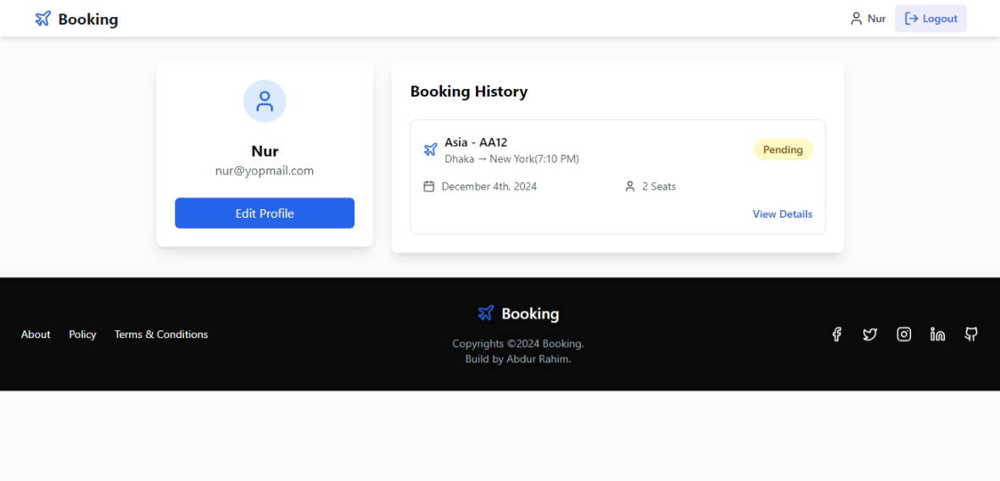
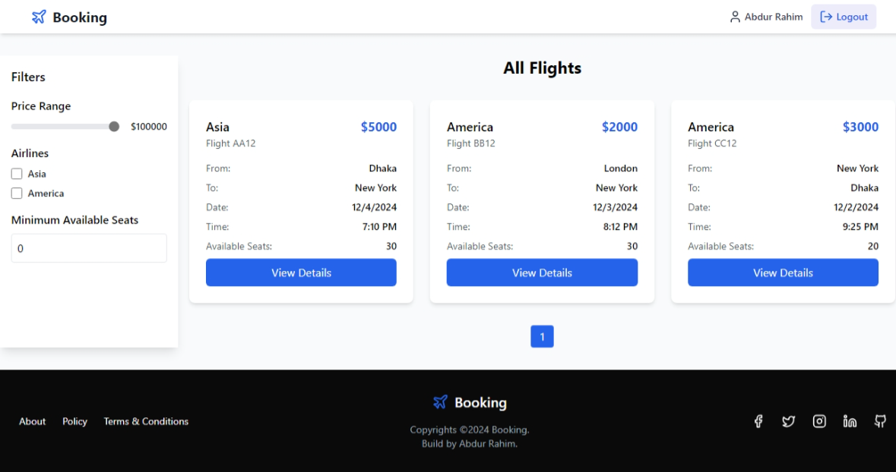
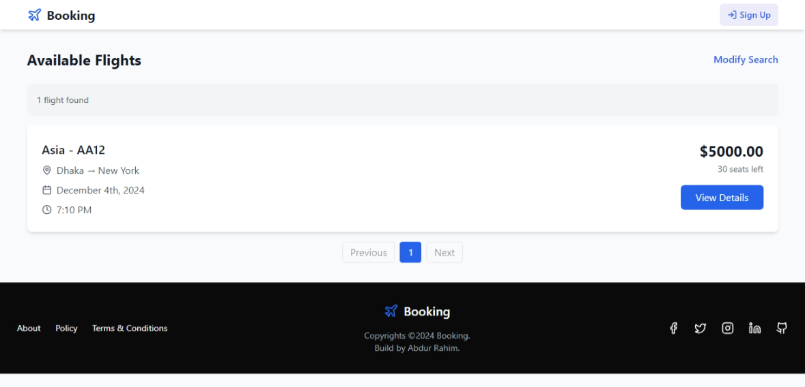
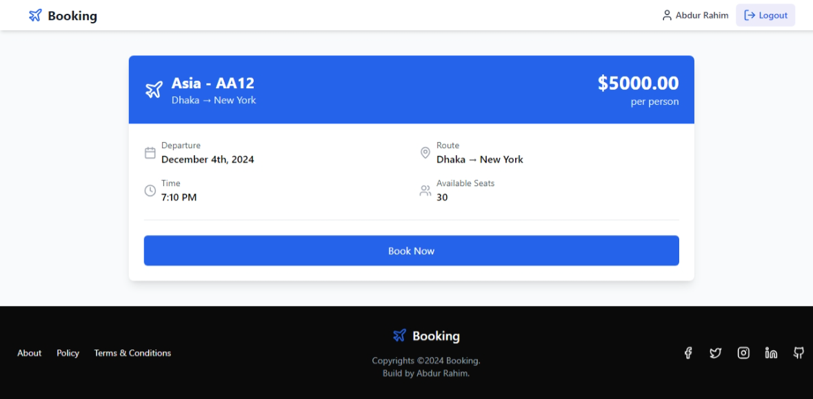
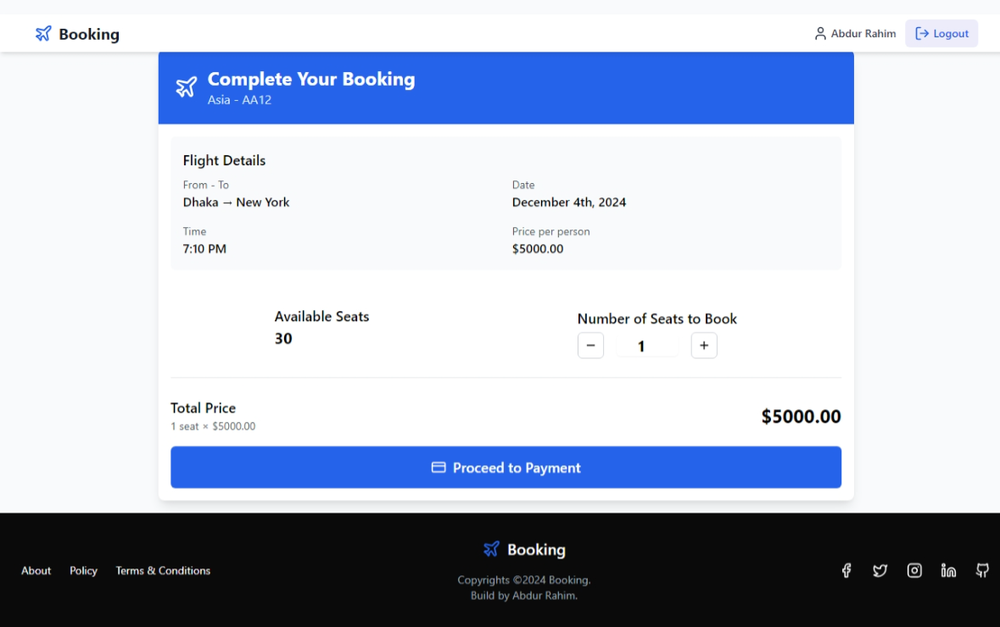
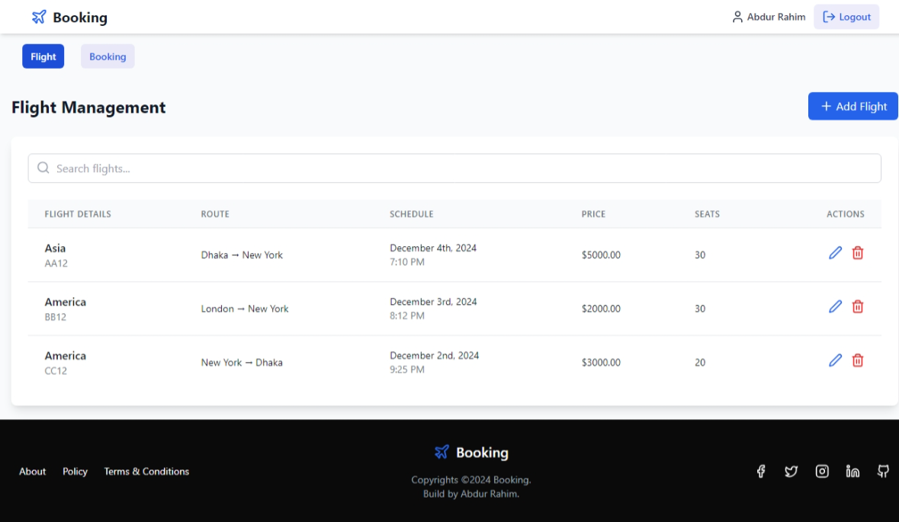
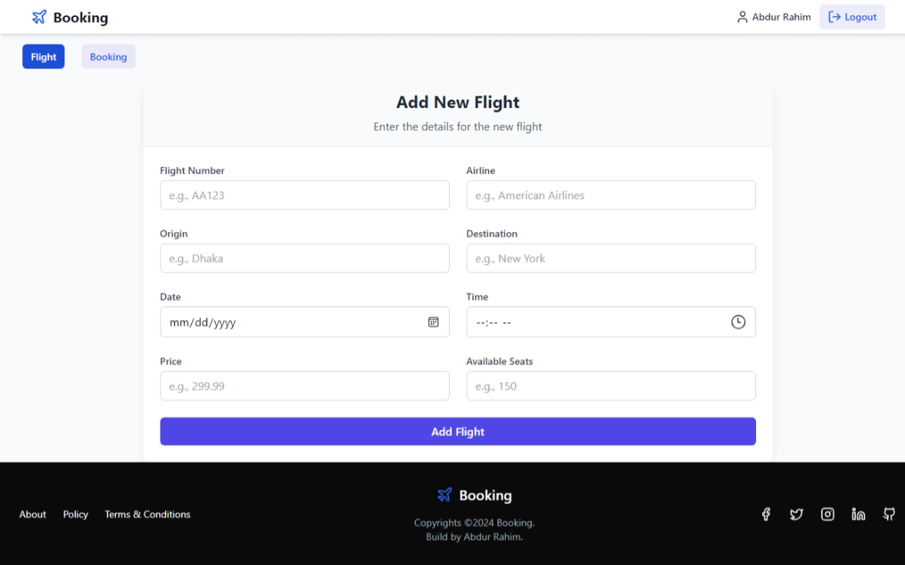
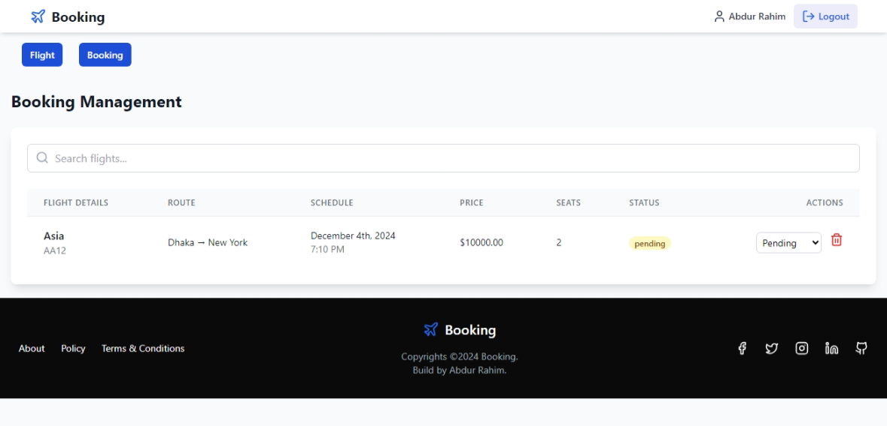
#### responsive


## Connect on Social Media
- [Twitter](https://twitter.com/AbdurRahim4G)
- [Instagram](https://www.instagram.com/abdurrahim4g/)
- [Facebook](https://www.facebook.com/Rahim72446)
- [LinkedIn](https://www.linkedin.com/in/abdur-rahim4g/)
- [YouTube](https://youtube.com/@AbdurRahimm)
